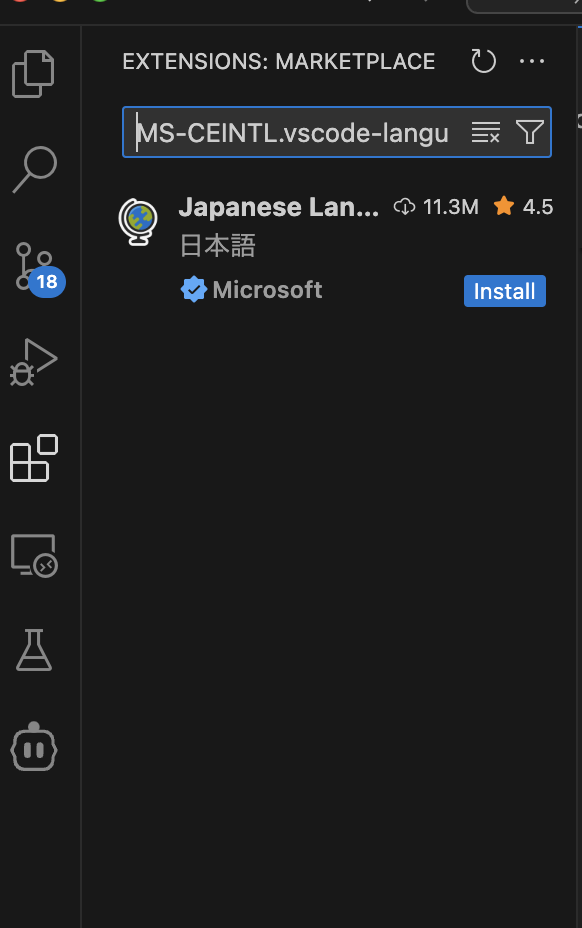
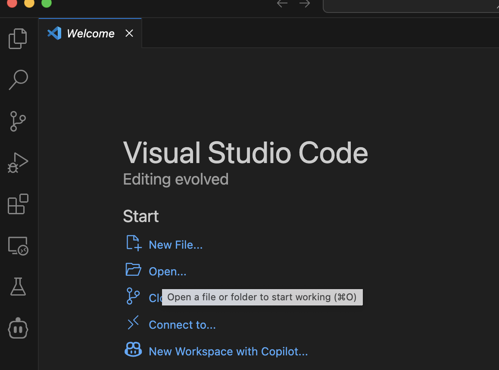
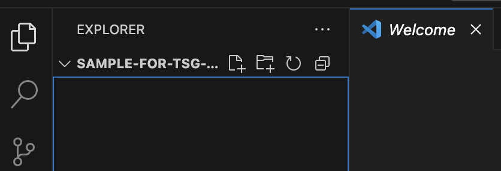
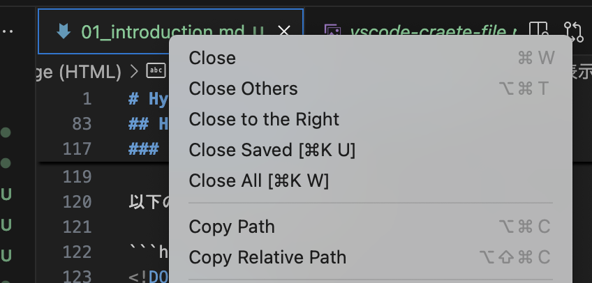
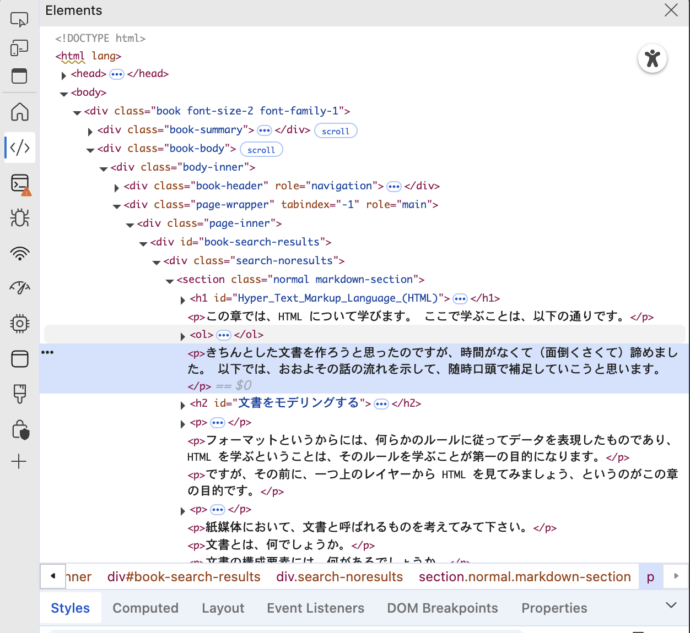

# Hyper Text Markup Language (HTML)

この章では、HTML について学びます。
ここで学ぶことは、以下の通りです。

1. HTML は、文書を木構造で表現するものである
2. 木構造を表現する言語として、HTML ではあらかじめ決められた「タグ」を用いている
3. VSCode とブラウザを使って、自分で HTML を書いて表示することができる
4. ブラウザで表示されている画面の HTML は、開発者ツールを使って確認することができる
5. HTML のタグは、MDN で調べることができる

きちんとした文書を作ろうと思ったのですが、時間がなくて（面倒くさくて）諦めました。
以下では、おおよその話の流れを示して、随時口頭で補足していこうと思います。


## 文書をモデリングする
HTML は、Hyper Text Markup Language の略で、hypertext documents を作成するためのデータフォーマットのことです。

フォーマットというからには、何らかのルールに従ってデータを表現したものであり、HTML を学ぶということは、そのルールを学ぶことが第一の目的になります。

ですが、その前に、一つ上のレイヤーから HTML を見てみましょう、というのがこの章の目的です。

HTML は、hypertext documents を作成するためのデータフォーマットと言いました。
hypertext という部分を一旦置いておいて、documents あるいは「文書」という部分に注目してみましょう。

紙媒体において、文書と呼ばれるものを考えてみて下さい。

文書とは、何でしょうか。

文書の構成要素には、何があるでしょうか。

文書を計算機上で表現するためには、どうすればいいでしょうか。

その答えの一つが、HTML です。
とはいえ、さまざまな動的な要素が追加され、
現在では紙の文書との違いが大きくなっているのは事実です。


## HTML の構造と記法
HTML は文書をどのようにモデリングしたかを説明します。

HTML は、文書を表現する基本ルールとして、木構造を採用しています。

文書の要素は階層構造を持っていて、
それぞれのノードがタイトルや本文、画像などに対応します。

では、木構造で表現できないものはあるでしょうか？
たとえば、ページと文を同時に木構造で表現できるかを考えてみましょう。

さて、データ構造としては木構造を採用していますが、
それを実際にどのようなフォーマットで記述するかも決めなければいけません。

HTML では、タグを使って木構造を表現します。
具体的には、以下のような形式で記述します。

```html
<!DOCTYPE html>
<html lang="en">
 <head>
  <title>Sample page</title>
 </head>
 <body>
  <h1>Sample page</h1>
  <p>This is a <a href="demo.html">simple</a> sample.</p>
  <!-- this is a comment -->
 </body>
</html>
```

とりあえず、以下のことを認識すれば大丈夫です。
- 開始タグと閉じタグがある（`<!DOCTYPE html>` は無視）
- タグにはいくつか種類がある
- タグが交差することはない（`<h1><p></h1></p>` みたいな）


cf. 経験者向け補足資料１。[マークアップのわかり方](https://yuheiy.com/2022-11-03-how-to-understand-the-markup)

cf. 経験者向け補足資料２。[RFC 1866: Hypertext Markup Language - 2.0](https://www.rfc-editor.org/rfc/rfc1866#page-6)

cf. 経験者向け補足資料３。[HTML Standard](https://html.spec.whatwg.org/multipage/#toc-introduction)


## HTML を書いてみよう

VSCode を使って HTML を書いてみましょう。

### 適当な作業用フォルダを作成する

名前はなんでもいいです。
たとえば、`tsg-sig-beginners-web-2025` などがいいでしょう。

なお、ファイル、フォルダについての前提知識があまりない人は、適当な動画を見ておくとよいでしょう。
最低限、今自分がどのフォルダにいて、どこにファイルを作って、次にそのファイルを開くときはどのようにひらけばいいのかを理解していれば大丈夫です。
Windows の人は、自分が OneDrive に保存したのか、なども認識しておくとよいでしょう。


### VSCode を起動する

まだインストールしていない人は、[こちらのサイト](https://code.visualstudio.com/)からダウンロードしておいてください。

なお、左側のサイドバーの拡張機能メニューから、日本語化の拡張機能をインストールすることができます。
どうしても日本語化したい人は、`MS-CEINTL.vscode-language-pack-ja` で検索して、インストールしておいてください。



### Open... を選択し、作成したフォルダを選択する



### `sample.html` という名前のファイルを作成する

プラスマークが右下についているファイルのアイコンをクリックして、ファイルを作成します。



### HTML を書いてみる


以下の HTML を書いてみましょう。

```html
<!DOCTYPE html>
<html lang="ja">
 <head>
  <title>TSG web 初心者分科会</title>
 </head>
 <body>
  <h1>HTML を作った</h1>
  <p><a href="https://tsg.ne.jp/">TSG</a>の初心者分科会で作ったサイト</p>
  <!-- this is a comment -->
 </body>
</html>
```

### ブラウザで表示してみる

ブラウザではローカルファイルの HTML を表示することができます。
URL のバーに、ローカルファイルのパスを入力すればよいです。
VSCode では、現在開いているタブを右クリックすると、
メニューが出てきて、
`Copy Path` という選択肢で
ファイルのパスをコピーすることができます。



あるいは、ブラウザに向けてドラッグアンドドロップでも表示できます。


### 表示内容を変えてみる
HTML を変更して、ブラウザで表示してみましょう。
たとえば、「HTML を作った」という部分を「HTML を作ったぜ！」に変えてみましょう。

ブラウザではリロードが必要です。


## タグの種類
HTML では、タグを使って木構造を表現します。
タグはあらかじめ定められていて、
初心者はよくつかうタグを覚えていくのが、最初の勉強です。

- `head`, `body`: ドキュメントのメタデータを表す部分と本文を表す部分
- `<h1>`, `<h2>`, `<h3>`, `<h4>`, `<h5>`, `<h6>`: 見出し
- `<p>`: 段落
- `<a>`: リンク
- ``: 画像
- `<video>`: 動画
- `br`: 改行
- `<div>`: ブロック要素
- `<span>`: インライン要素
- `<ul>`, `<ol>`, `<li>`: リスト
- `<table>`, `<tr>`, `<td>`: 表
- `<form>`, `<input>`: フォーム
- `<script>`: JavaScript を埋め込む
- `<style>`: CSS を埋め込む

タグは、属性を持つことがあります。
たとえば、リンクを作成する `<a>` タグは、`href` 属性を持ちます。
`href` 属性には、リンク先の URL を指定します。

```html
<a href="https://example.com">Example</a>
```

タグの属性は、`<tagname attribute="value">` のように書きます。
属性は、複数指定することもできます。
```html
<a href="https://example.com" target="_blank" rel="noopener noreferrer">Example</a>
```

## 検証画面
ブラウザには、開発者ツールという機能があります。
開発者ツールを使うと、ブラウザで表示されている HTML を確認することができます。

開発者ツールは、右クリックメニューから開くことができます。
`検証`とか`developer tools`とか書いてあると思います。

開発者ツールを開くと、HTML の構造が表示されます。


## 課題１：検証ツールでいろんな HTML を見てみる

開発者ツールを使って、自分が普段使っているウェブサイトの HTML を見てみましょう。
そして、どのようなタグが使われているかを確認してみましょう。

上で紹介したタグ以外のタグを見つけてみましょう。

## 課題２：MDN で調べてみる
共通で参照するべき場所を知っておくことは重要です。
Web 開発においては、MDN Web Docs がその役割を果たします。
ほぼ一次資料といってもいいでしょう。

上記で見つけたタグを MDN で調べてみましょう。

cf. https://developer.mozilla.org/en-US/docs/Web/HTML/Reference/Elements

cf. 経験者向け補足資料１。[HTML Living Standard](https://html.spec.whatwg.org/multipage/)