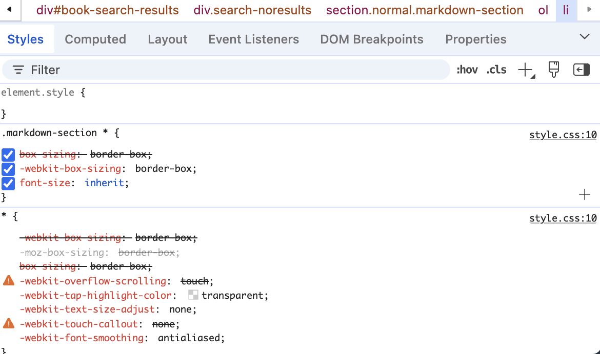

# Cascading Style Sheets (CSS)

この章では、HTML のスタイルを指定するための CSS について学びます。
以下のことが理解できるようになればいいでしょう。

1. CSS は、HTML の見た目を指定するための言語である
2. id, class, tag といった識別子を使って、HTML の要素を指定することができ、それをセレクタと呼ぶ
3. セレクタを指定したうえで、プロパティと値を指定することで、HTML の要素のスタイルを指定することができる
4. CSS は、`<style>` タグの中に記述するか、`<link>` タグを使って読み込むことができる
5. 開発者ツールを使って、CSS を確認し編集することができる

## CSS とは
CSS は、Cascading Style Sheets の略で、HTML の見た目を指定するための言語です。
CSS を使うことで、HTML の要素の色やフォント、レイアウトなどを指定することができます。

```html
<!DOCTYPE html>
<html lang="en">
 <head>
  <title>Sample page</title>
  <style>
    h1 {
      color: blue;
    }
    .main-text {
      font-size: 20px;
    }
    #link {
      color: red;
    }
    #link:hover {
      color: green;
    }
  </style>   
 </head>
 <body>
  <h1>Sample page</h1>
  <p class="main-text">This is a <a id="link" href="demo.html">simple</a> sample.</p>
 </body>
</html>
```

これをブラウザで表示してみてください。

`.main-text` のように、ドットの後に続く文字列は、class を指定するためのセレクタです。
`#link` のように、シャープの後に続く文字列は、id を指定するためのセレクタです。
`#link:hover` のように、セレクタの後に `:hover` を付けることで、マウスオーバーしたときのスタイルを指定することができます。

## 構造とスタイルの分離
CSS を使うことで、HTML の構造とスタイルを分離することができます。
この主張が正しく、構造とスタイルがうまく分離できているとすると、同じ文書をやり取りしているにもかかわらず、異なるスタイルで表示することができるようになります。たとえば、ユーザーの好みに応じて、強調の文字色を変えたりすることができます。

## CSS ファイルと link タグ
一般的に、CSS は、HTML の中に直接書くのではなく、別のファイルに書いて、それを読み込む形で使います。
そのためには、`<link>` タグを使います。

```html
<!DOCTYPE html>
<html lang="en">
 <head>
  <title>Sample page</title>
  <link rel="stylesheet" href="style.css">
 </head>
 <body>
  <h1>Sample page</h1>
  <p class="main-text">This is a <a id="link" href="demo.html">simple</a> sample.</p>
 </body>
</html>
```

HTMLをこのように書いたうえで、同じディレクトリに `style.css` というファイルを作成し、以下のように書いてください。

```css
h1 {
  color: blue;
}
.main-text {
  font-size: 20px;
}
#link {
  color: red;
}
#link:hover {
  color: green;
}
```

これをブラウザで表示してみてください。開発者ツールの Network タブを開いて、CSS ファイルが読み込まれていることを確認してください。
`<link>` タグの `href` 属性に、CSS ファイルのパスを指定することで、CSS を読み込むことができます。

## 主要なプロパティ
CSS には、さまざまなプロパティがありますが、ここでは主要なものをいくつか紹介します。

- `display`: 要素の表示方法を指定します。
  - `block`、`inline`、`inline-block` などがあります。
  - `grid`, `flex` などのレイアウトを調べると、二段組や中央揃えなどが楽にできます。
- `color`: 文字の色を指定します。
- `background-color`: 背景色を指定します。
- `font-size`: 文字の大きさを指定します。
- `font-family`: フォントを指定します。
- `margin`: 要素の外側の余白を指定します。
- `padding`: 要素の内側の余白を指定します。
- `border`: 要素の枠線を指定します。
- `width`: 要素の幅を指定します。
- `height`: 要素の高さを指定します。
- `text-align`: 文字の揃え方を指定します。
- 擬似クラス: `:hover`, `:focus`, `:active` など、特定の状態のスタイルを指定できます。
- メディアクエリ: `@media` を使って、画面サイズやデバイスに応じたスタイルを指定できます。@container も便利です


## 開発者ツール
開発者ツールを使うことで、CSS を確認したり、編集したりすることができます。
Element タブを開いて、HTML の要素を選択すると、その要素の CSS が表示されます。




## 課題１：歌詞サイト
コピーを可能にしてみよう。

https://www.lyrical-nonsense.com/lyrics/nijisanji/virtual-to-live/


## 課題２：ポップアップ
だいぶ難しめです。
２つの要素を消して、２つの CSS プロパティを無効化する必要があります。

https://www.kyobun.co.jp/article/2025051601


## 課題3: スタイルを自分で作ってみよう

以下のサイトの h1 タグの CSS を再現してみましょう。

1. https://utelecon.adm.u-tokyo.ac.jp/oc/
2. https://blog.jxck.io/entries/2025-05-12/age-of-phishing.html

## 課題4: 自分でウェブサイトを書いてみよう

自分でウェブサイトを書いてみましょう。
題材はなんでもいいですが、以下の点を満たすとちょうどいい難易度になるでしょう。

- 画像や動画といったメディアを利用する
- スマホにも対応する（メディアクエリ、コンテナクエリ）


## 参考資料
cf. https://developer.mozilla.org/ja/docs/MDN/Tutorials