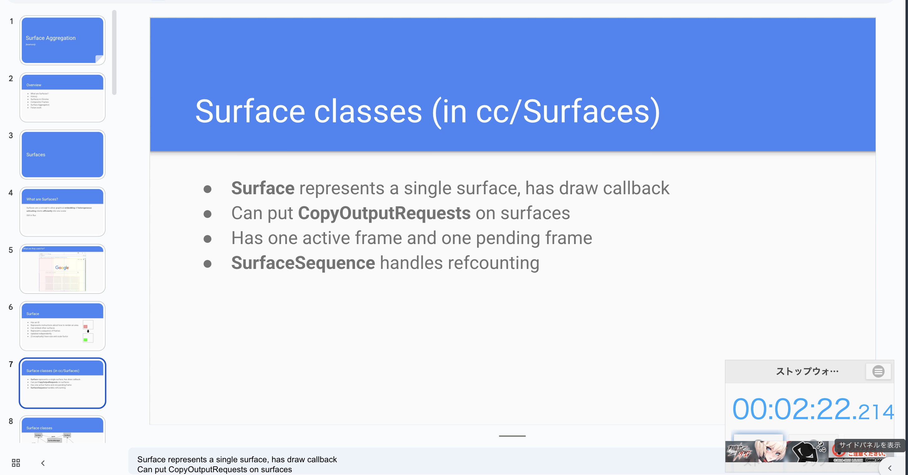

# JavaScript 2 / DOM操作編

この章では、JavaScriptを使ってHTMLの要素を動的に操作する方法について学びます。前回学んだJavaScriptの基本構文を基礎として、実際にWebページを動的に変更できるようになることが目標です。

ここで学ぶことは、以下の通りです。

1. HTMLの宣言的な性質とJavaScriptの手続的な性質の違いを理解する
2. JavaScriptを使ってHTML要素の情報を読み取ることができる
3. JavaScriptを使ってHTML要素の内容やスタイルを動的に変更することができる
4. フォーム要素と連携して、ユーザー入力を処理することができる

## 宣言的なHTMLと手続的なJavaScript

HTMLは文書の構造を宣言的に表現します。「宣言的」とは、「何をしたいか」を記述する方法です。

```html
<h1>タイトル</h1>
<p>これは段落です。</p>
```

これは「h1要素としてタイトルを表示し、p要素として段落を表示する」ということを宣言しています。どのようにブラウザがそれを実現するかは、ブラウザに任せています。

一方、JavaScriptは手続的なプログラミング言語です。「手続的」とは、「どのようにするか」を順序立てて記述する方法です。

```javascript
// 手続的な記述の例
const title = document.createElement('h1');
title.textContent = 'タイトル';
document.body.appendChild(title);
```

この例では、「h1要素を作成し、テキストを設定し、bodyに追加する」という手順を明確に指定しています。

HTMLの宣言的な世界とJavaScriptの手続的な世界を結びつけるのが、DOM（Document Object Model）です。DOMは、HTMLドキュメントをJavaScriptから操作できるオブジェクトの集合として表現したものです。

## DOMの読み取り

以下では、検証画面の console タブを使って実習を行います。

### 基本的な要素の取得

```javascript
// IDで取得（最も高速）
const element = document.getElementById('main-title');

// CSSセレクタで取得（最初の1つ）
const firstParagraph = document.querySelector('p');
const highlightElement = document.querySelector('.highlight');

// CSSセレクタで取得（すべて）
const allParagraphs = document.querySelectorAll('p');
const allHighlights = document.querySelectorAll('.highlight');
```

cf. [Document - Web API | MDN](https://developer.mozilla.org/ja/docs/Web/API/Document)

取得した要素は、`HTMLElement`型のオブジェクトです。これを使って、要素の情報を取得したり、操作したりします。
https://developer.mozilla.org/en-US/docs/Web/API/HTMLElement


例えば、[J-STAGE のページ](https://www.jstage.jst.go.jp/article/jkg/65/6/65_KJ00009971595/_article/-char/ja)でタイトルを取得するには、以下のようにします。

```javascript
document.querySelector(".global-article-title").innerText
```

### 実習1：要素の情報を取得してみよう

以下のサイトにおいて、論文のタイトルを 2 つの方法で取得してみましょう。

https://arxiv.org/abs/1409.0473 

一つ目は、`<head><title>` タグから取得する方法です。
二つ目は、表示されている h1 タグから取得する方法です。

どちらの方法でも、必要ない部分が入ってきてしまうと思うので、できる人は正規表現でいらない部分を取り除いてください。
JS では、`"title".replaceAll(/aaa/g, '')` のような感じでできます。

```javascript
const title = // title 文字列を取得するコード
title.replaceAll(/aaa/g, '')
```


## DOM APIの基本概念

DOMの読み取りを学んだところで、DOM APIの基本的な型について詳しく学びましょう。

### Node型とElement型

DOM APIの中心となるのは[Node型](https://developer.mozilla.org/ja/docs/Web/API/Node)です。HTMLドキュメント内のすべての要素、テキスト、コメントなどは、Node型またはその派生型として表現されます。

```javascript
// Node型の基本プロパティ
const element = document.getElementById('sample');

console.log(element.nodeType);    // ノードの種類（1=要素、3=テキストなど）
console.log(element.nodeName);    // ノード名（要素の場合はタグ名）
console.log(element.nodeValue);   // ノードの値（要素の場合はnull）
console.log(element.parentNode);  // 親ノード
console.log(element.childNodes);  // 子ノードのリスト
```

[Element型](https://developer.mozilla.org/ja/docs/Web/API/Element)は、Node型を継承したより具体的な型で、HTMLの要素（タグ）を表現します。

```javascript
// Element型の基本プロパティ
const element = document.getElementById('sample');

console.log(element.tagName);        // タグ名（大文字）
console.log(element.id);             // id属性
console.log(element.className);      // class属性
console.log(element.children);       // 子要素のリスト（テキストノードは含まない）
console.log(element.innerText);     // 表示されるテキスト
```

### NodeListとHTMLCollection

DOM APIでは、複数の要素を扱う際に[NodeList](https://developer.mozilla.org/ja/docs/Web/API/NodeList)と[HTMLCollection](https://developer.mozilla.org/ja/docs/Web/API/HTMLCollection)という2つの型が使われます。

```javascript
// NodeList
const nodeList = document.querySelectorAll('p');
console.log(nodeList.length);
nodeList.forEach(node => console.log(node.textContent));

// HTMLCollection
const htmlCollection = document.getElementsByTagName('p');
console.log(htmlCollection.length);
for (let i = 0; i < htmlCollection.length; i++) {
    console.log(htmlCollection[i].textContent);
}
```


## DOMへの書き込み

### テキスト内容の変更

```javascript
const element = document.getElementById('target');

element.textContent = '新しいテキスト';

// XSS 攻撃に注意
element.innerHTML = 'これは<strong>強調</strong>されたテキストです';
```


### スタイルとクラスの変更

```javascript
const element = document.getElementById('target');

// 直接スタイルを変更
element.style.color = 'red';
element.style.backgroundColor = 'yellow';

// CSSクラスを操作
element.classList.add('highlight');
element.classList.remove('old-style');
element.classList.toggle('active');

if (element.classList.contains('important')) {
    console.log('重要な要素です');
}
```

### 要素の作成と削除

```javascript
// 新しい要素の作成
const newParagraph = document.createElement('p');
newParagraph.textContent = '新しい段落です';
newParagraph.className = 'dynamic-content';

// 要素の追加
const container = document.getElementById('container');
container.appendChild(newParagraph);

// 要素の削除
const elementToRemove = document.getElementById('old-element');
elementToRemove.remove();
```

### 実習： iframeを使ったタイマーの表示

Google Slide のページに iframe でタイマーのサイトを表示してみましょう。
サイトのリンクは、https://timer.onl.jp/　です。

display: fiexed; を使って、iframe の位置を固定してみるとよいでしょう。



## イベントハンドリングとフォーム

### addEventListener の基本

```javascript
const button = document.getElementById('my-button');

// 基本的な使い方
button.addEventListener('click', function() {
    console.log('ボタンがクリックされました');
});

// アロー関数を使った書き方
button.addEventListener('click', () => {
    console.log('ボタンがクリックされました');
});
```

### フォーム要素の基本操作

以下のようなフォームを考えます。

```html
<html>
  <head>
    <title>フォームの例</title>
    <meta charset="UTF-8">
  </head>
  <body>
    <form id="my-form">
      <input type="text" id="text-field" name="text-field"><br>

      <label for="select-field">セレクトフィールド:</label>
      <select id="select-field" name="select-field">
        <option value="option1">オプション1</option>
        <option value="option2">オプション2</option>
        <option value="option3">オプション3</option>
      </select><br>

      <label for="checkbox">チェックボックス:</label>
      <input type="checkbox" id="checkbox" name="checkbox" value="XXXX">

      <button type="submit" id="submit-button">送信</button>
    </form>
    <script src="script.js"></script>
  </body>
</html>
```

以下のようにフォームの値を取得・設定することができます。

```javascript
// 各種フォーム要素の値を取得・設定
const textField = document.getElementById('text-field');
const selectField = document.getElementById('select-field');
const checkbox = document.getElementById('checkbox');

// 値の取得
console.log(textField.value);
console.log(selectField.value);
console.log(checkbox.checked);

// 値の設定
textField.value = '新しい値';
selectField.value = 'option2';
checkbox.checked = true;

const button = document.getElementById('submit-button');
button.addEventListener('click', (event) => {
    event.preventDefault(); // フォームの送信を防ぐ
    console.log('フォームが送信されました');
    console.log('テキストフィールドの値:', textField.value);
    console.log('セレクトフィールドの値:', selectField.value);
    console.log('チェックボックスの状態:', checkbox.checked);
    console.log('チェックボックスの値:', checkbox.value);
});
```

## 課題
シラバスのデータを作って、それをもとに履修した授業の一覧とそれに対応するチェックボックスを作成してください。
その後、チェックボックスの状態を取得して、履修した授業の単位数を計算するボタンを作成してください。

```javascript
const syllabus = [
  // シラバスデータ
]

const container = document.getElementById('container');
syllabus.forEach(course => {
  // ラベルとチェックボックスを作成
})
```

## 余談
ブックマークレットというものがあります。
ブックマークボタンを押すと特定の JavaScriptコードが実行できる仕組みです。
便利なので調べてみてください。

簡単にいえば、
```javascript
javascript:(function() {
  // ここに実行したいJavaScriptコードを書く
})();
```
という形式でリンクを作成し、
それをブックマークに登録します。

たとえば、現在のページを Internet Archive でみたいときには、
```javascript
javascript:(function() {
  window.location.href = `https://web.archive.org/web/*/${window.location.href}`;
})();
```
というブックマークレットを作成します。

cf. [■補足情報：学外にいるとき、みつけた論文を読む方法あれこれ | 東京大学附属図書館](https://www.lib.u-tokyo.ac.jp/ja/library/literacy/user-guide/campus/offcampus/ezproxy/others#marklet)

## 次回までに暇があればやっておいてほしい課題
シラバスデータを用意したいとき、どのようにデータを取得するかを考えてみてください。
必要なデータ（単位数、授業名、総合科目の系列）を含めるには、どのような方法を使えばいいでしょうか。

## まとめと次回予告

この章では、HTMLの宣言的な性質とJavaScriptの手続的な性質の違いを理解し、DOM APIを通じてWebページを動的に操作する方法を学びました。
次回はネットワークリクエストとライブラリとスクレイピングの話をします。
