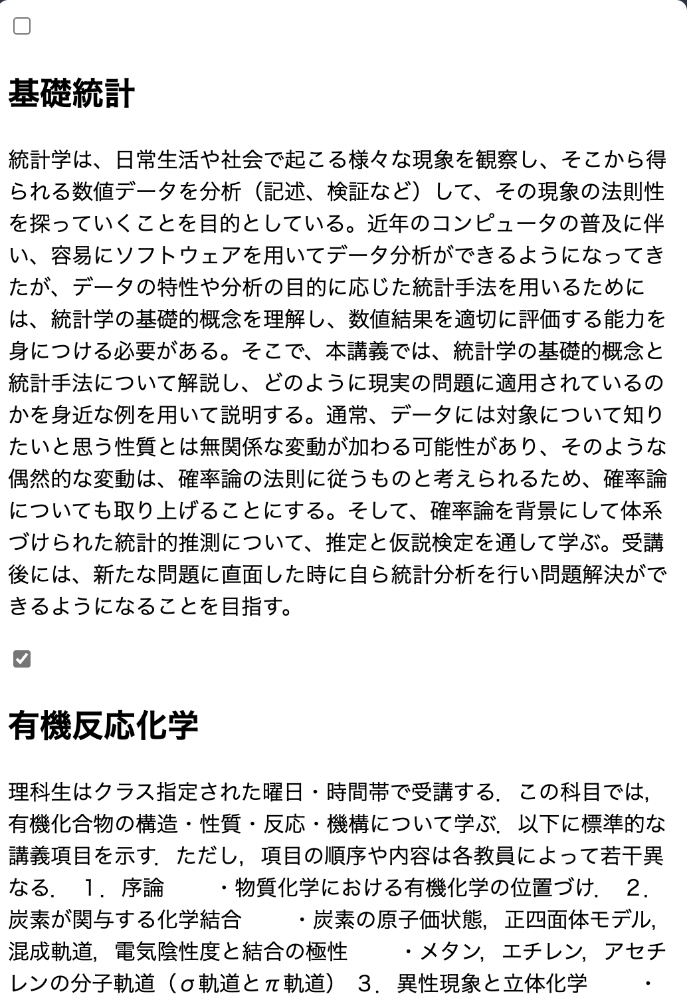

# スクレイピング編

次のマークダウンファイルの作成に移りましょう。以下の構成です。

以下は学ぶことです。
- JavaScript を自分のPCで実行できるようにする
- ライブラリのエコシステムの存在を知る
- スクレイピングの流れと注意点を理解する
- データの収集先の重要性を理解する


## CSS セレクタの復習

https://catalog.he.u-tokyo.ac.jp/result?type=jd&q= からいろんな要素を取得する練習。

`document.querySelector` を使って、特定の要素を取得する練習。
`querySelector`や`querySelectorAll`の引数を適切に指定してください。

### 1.タブのタイトルを取得する

title タグの中身を取得しましょう。

```javascript
const title = document.querySelector('').textContent;
console.log(title);
// '検索結果 - 東京大学授業カタログ'
```

### 2.id を使って、2025年版を取得する

```javascript
const year2025 = document.querySelector('').textContent.trim();
console.log(year2025);
// '2025年度版'
```

### 3.クラスを使って、授業のタイトルを１つ取得する

```javascript
const classTitle = document.querySelector("").textContent.trim()
console.log(classTitle);
// '基礎統計'
```

### 4. クラスを使って授業のタイトルをすべて取得する

```javascript
const classTitles = document.querySelectorAll('');
for (let i = 0; i < classTitles.length; i++) {
    console.log(classTitles[i].textContent.trim());
}
// 基礎統計
// 有機反応化学
// 数理科学基礎
// 身体運動・健康科学実習Ⅰ（ﾒﾃﾞｨｶﾙｹｱ3）
// 身体運動・健康科学実習Ⅱ（ﾒﾃﾞｨｶﾙｹｱ3）
// 英語上級
// ドイツ語初級（会話）
// ドイツ語初級（インテンシヴ）
// 中国語初級（演習）
// スペイン語初級（演習）
```

### 5.クラスを使って授業の概要をすべて取得する

```javascript
const classDescriptions = document.querySelectorAll('');
// 自分で for ループを書いて、各授業の概要を出力してください。
```

### 6.クラスを使って授業のリンクをすべて取得する

「詳細を見る」ボタンのリンクを取得しましょう。
いくつかやり方はありますが、制限を設けます。
`catalog-search-result-card-header-detail-link` クラスを指定せずに取得してみてください。

ヒントです。CSS セレクタのネストを使ってみてください。
```html
<div class="box">
  <a href="./aa.html">aa</a>
</div>
```

は、`div.box a` で取得できます。

```javascript
const classLinks = document.querySelectorAll('');
for (let i = 0; i < classLinks.length; i++) {
    console.log(classLinks[i].href);
}
```

### 回答

```javascript
// 1. タブのタイトルを取得する
// CSS セレクタで、特定のタグを取得するには、タグの名前をそのまま指定します。
const title = document.querySelector('title').textContent;
console.log(title);

// 2. id を使って、2025年版を取得する
// id は # を使って指定します。
const year2025 = document.querySelector('#catalog-header-logo').textContent.trim();
console.log(year2025);

// 3. クラスを使って、授業のタイトルを１つ取得する
// クラスは、クラス名の前に . を使って指定します。
const classTitle = document.querySelector('.catalog-search-result-card-header-name').textContent.trim();
console.log(classTitle);

// 4. クラスを使って授業のタイトルをすべて取得する
// querySelectorAll は、複数の要素を取得するために使います。
const classTitles = document.querySelectorAll('.catalog-search-result-card-header-name');
for (let i = 0; i < classTitles.length; i++) {
    console.log(classTitles[i].textContent.trim());
}

// 5. クラスを使って授業の概要をすべて取得する
// 授業の概要は、別のクラス名を使って取得します。
const classDescriptions = document.querySelectorAll('.catalog-search-result-card-body-text');
for (let i = 0; i < classDescriptions.length; i++) {
    console.log(classDescriptions[i].textContent.trim());
}

// 6. クラスを使って授業のリンクをすべて取得する
// リンクは、a タグを使って取得します。
const classLinks = document.querySelectorAll('.catalog-search-result-card-header-button-container a');
for (let i = 0; i < classLinks.length; i++) {
    console.log(classLinks[i].href);
}
```

## node と npm

口頭で node と npm の説明をします。

volta を使ってインストール。

https://docs.volta.sh/guide/getting-started

Windows の人は、
```
winget install Volta.Volta
```

Mac の人は、
```
curl https://get.volta.sh | bash
```

を実行したうえで、
```
volta install node # node をインストール
node -v
npm -v
```

## npm でライブラリをインストール
npm init で package.json を作成し、JSDOM をインストールする
適当なディレクトリを作成し、そこで VS Code を開いてください。
VS Code のターミナルで以下を実行します。

```bash
npm init # package.json を作成
npm install jsdom # JSDOM をインストール
```

## スクレイピングの流れ
fetch を使って HTML を取得し、JSDOM でパースする。
以下のコードを実行して、HTML を取得し、JSDOM でパースします。

まず、`index.mjs` というファイルを作成し、以下のコードを記述してください。

```javascript
import { JSDOM } from 'jsdom';

const url = 'https://catalog.he.u-tokyo.ac.jp/result?type=jd&q=';
// HTML を取得
const response = await fetch(url);
const html = await response.text();
// ローカルで DOM を作成
const dom = new JSDOM(html);
const document = dom.window.document;
const title = document.querySelector('title').textContent;
console.log(title); // '検索結果 - 東京大学授業カタログ'
```


### 演習：授業一覧を取得する

CSS セレクタの復習を思い出しながら、授業のタイトルと概要を取得して、JSON で保存するコードを書いてみましょう。

```javascript
import { JSDOM } from 'jsdom';
import { writeFile } from 'fs/promises';
import path from 'path';

const url = 'https://catalog.he.u-tokyo.ac.jp/result?type=jd&q=';
const response = await fetch(url);
const html = await response.text();
const dom = new JSDOM(html);
const document = dom.window.document;

// classes に
// {
//   title: '基礎統計',
//   description: 'この授業では、統計学の基礎を学びます。'
// }
// のようなオブジェクトを格納します。
const classes = [];

// -------
// ここにコードを書く
// -------

// 現在のフォルダに classes.json を保存する
const outputPath = path.join(process.cwd(), 'classes.json');
await writeFile(outputPath, JSON.stringify(classes, null, 2));
console.log(`Classes saved to ${outputPath}`);
```


## スクレイピングの注意点
スクレイピングを行う際は、サーバーに負荷をかけないように、適切な間隔をあけてリクエストを送ることが重要です。例えば、1秒ごとにリクエストを送るようにするなどの工夫が必要です。

cf. [Librahack ： 容疑者から見た岡崎図書館事件](http://librahack.jp/)
cf. [コインハイブ事件のご報告とこれからのこと｜モロ](https://note.com/morois/n/n7210db925aa1)
cf. [ep123 Engineering Risk | mozaic.fm](https://mozaic.fm/episodes/123/engineering-risk.html)

## データの収集先の重要性
UTAS, PDF, 授業カタログを比較しながら、口頭で補足します。

## 最終課題：作成した JSON から授業リストを表示しよう
作成した JSON ファイルの中身の文字列をコピペして、JS ファイルで変数として扱えるようにしましょう。
そして、第4回で習ったように、フォームをこのデータから構築してみましょう。
たとえば、以下のようなコードになるはずです。

```javascript
// このファイルを html ファイルから読み込む
const classes = [
  {
    "title": "基礎統計",
    "description": "統計学は、日常生活や社会で起こる様々な現象を観察し、そこから得られる数値データを分析（記述、検証など）して、その現象の法則性を探っていくことを目的としている。近年のコンピュータの普及に伴い、容易にソフトウェアを用いてデータ分析ができるようになってきたが、データの特性や分析の目的に応じた統計手法を用いるためには、統計学の基礎的概念を理解し、数値結果を適切に評価する能力を身につける必要がある。そこで、本講義では、統計学の基礎的概念と統計手法について解説し、どのように現実の問題に適用されているのかを身近な例を用いて説明する。通常、データには対象について知りたいと思う性質とは無関係な変動が加わる可能性があり、そのような偶然的な変動は、確率論の法則に従うものと考えられるため、確率論についても取り上げることにする。そして、確率論を背景にして体系づけられた統計的推測について、推定と仮説検定を通して学ぶ。受講後には、新たな問題に直面した時に自ら統計分析を行い問題解決ができるようになることを目指す。"
  },
  {
    "title": "有機反応化学",
    "description": "理科生はクラス指定された曜日・時間帯で受講する．この科目では，有機化合物の構造・性質・反応・機構について学ぶ．以下に標準的な講義項目を示す．ただし，項目の順序や内容は各教員によって若干異なる．\n\n１．序論\n　　・物質化学における有機化学の位置づけ．\n２．炭素が関与する化学結合\n　　・炭素の原子価状態，正四面体モデル，混成軌道，電気陰性度と結合の極性\n　　・メタン，エチレン，アセチレンの分子軌道（σ軌道とπ軌道）\n３．異性現象と立体化学\n　　・異性体，立体配座，立体配置，不斉現象，キラリティー，RS表示\n４．有機化合物の性質\n　　・分子間力，水素結合，分散力，酸と塩基，共役系，芳香族性\n５．有機化合物の反応およびその機構\n　　・脂肪族求核置換反応，脱離反応，付加反応，付加環化反応，転位反応，\n　　　芳香族求電子置換反応，カルボニル化合物の反応\n　　・一次反応，二次反応，反応中間体，反応遷移状態，化学平衡\n６．目的化合物の合成\n　　・逆合成解析，生理活性物質の合成，機能物質の合成"
  },
]

// <div id="class-list"></div> というのを HTML ファイルに書いておく
const classList = document.querySelector('#class-list');
classes.forEach(cls => {
    const classItem = document.createElement('div');
    classItem.innerHTML = `
<div class="card-header">
  <input type="checkbox" class="card-header-checkbox">
  <h2>${cls.title}</h2>
</div>
<div class="card-body">
<p>${cls.description}</p>
</div>`;
    classList.appendChild(classItem);
});
```

以下のような画面が表示されるはずです。




# まとめ
以上で、講義を終わります。
今回の課題で作ったスクレイピングのスクリプトと、そこで収集した情報をもとにサイトを動的に生成するスクリプトを発展させれば、
最初に少し見せたような修了要件判定サイトを作成することができるはずです。

スクレイピングスクリプトは、リンクを辿って 2 ページ目移行の授業も取得したり、各授業の詳細ページから単位数などの詳細情報を取得することが必要でしょう。
ウェブサイトの HTML と JS のほうは、CSS を調整してみやすいサイトにしたり、
チェックボックスの状態を取得して修了要件を判定する機能を追加したり、
検索機能を追加したりすることが考えられます。

さらに高度なことにチャレンジしたい場合は、
フロントエンド用のライブラリを使ってみたり、
TypeScript を使ってみたり、
サーバーを立ててインターネットに公開してみたり、
授業データをデータベースに保存してみたりするのがよいでしょう。
たとえば、ウェブサイト作成だと [React](https://react.dev/) というフレームワークのシェアが高いです。
ドキュメントもそこそこ充実しています。
本で学びたいという人は、私が読んだ中では[りあクト！ TypeScriptで始めるつらくないReact開発](https://oukayuka.booth.pm/items/2368045)という本が丁寧でよかったです。


あるいはセキュリティ方面に進んでみるのもありです。
ウェブは現代には欠かせないものになり、
決済手段が提供されていたり、
個人情報、機密情報が扱われることも多いです。
ウェブセキュリティの教科書的な本としては、[安全なWebアプリケーションの作り方 第2版](https://wasbook.org/)が有名です。
また、ウェブセキュリティをブラウザという、重要だけれど見過ごされがちな側面から学ぶ本として、[Webブラウザセキュリティ ― Webアプリケーションの安全性を支える仕組みを整理する](https://www.lambdanote.com/collections/wbs)があります。

個人的なおすすめとしては、
[mozaic.fm](https://mozaic.fm/)という podcast の通常回（monthly, yearly とかがついていないやつ）や、
同一人物の[ブログ](https://blog.jxck.io/) が、Web を中心にしたコンテンツを扱っていて、非常に面白いです。
たとえば、[ep119 大規模ライブ配信](https://mozaic.fm/episodes/119/live-streaming.html)では、Abema のワールドカップのライブ配信の舞台裏を語っています。

